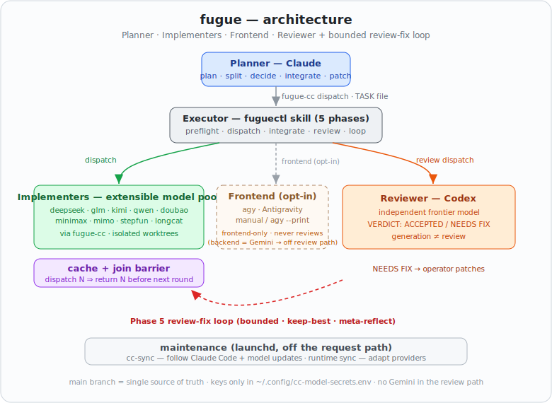

# open-sakanafugu

[](https://github.com/BicaMindLabs/open-sakanafugu/actions/workflows/ci.yml)
[](LICENSE)
[](package.json)
[](orchestration/fanout)

**English | [简体中文](README_ZH.md)**

> **open-sakanafugu** is an open, harness-engineered take on [Sakana AI's Fugu](https://sakana.ai/fugu/): **many agents behind one interface**, coordinated into a single trustworthy answer by *orchestration* rather than a bigger model. A fleet of cheap models implements, an independent-family reviewer judges, and a **bounded review-fix loop** converges to acceptance — never looping forever, never hard-marking done.

Fugu's bet is that **coordination, not raw model size, is the lever** — a learned conductor routes work across specialized agents and verifies the result. open-sakanafugu reproduces that *shape* with **engineering instead of training**: one [`fanout`](#the-fanout-cli) CLI is the single interface; **9 Chinese LLMs** (each an isolated Claude Code instance) are the workers; a different-family reviewer (Codex) is the verifier; and the router is a **Bayesian bandit that learns which model wins which task type** from every review verdict — a training-free analogue of Fugu's evolved coordinator. A fan-out/fan-in cache guarantees completeness, and per-task **workspace isolation** keeps weak models from drowning in context.

---

## Table of Contents

- [Why](#why)
- [Architecture](#architecture)
- [Relation to Sakana Fugu](#relation-to-sakana-fugu)
- [Repository layout](#repository-layout)
- [Quick start](#quick-start)
- [Install as a Claude Code Skill](#install-as-a-claude-code-skill)
- [The `fanout` CLI](#the-fanout-cli)
- [Workflow](#workflow)
- [Design principles](#design-principles)
- [Development](#development)
- [Security](#security)
- [Acknowledgements](#acknowledgements)
- [License](#license)

---

## Why

Small / cheap models fail when an agent shows them *every* tool, memory, rule and message on every step — latency and attention are wasted, and the model makes mistakes (an empirical [model benchmark](orchestration/fanout/allocation.tsv) in this repo shows exactly which models break on which task types). This project addresses that with **harness engineering**, not bigger models:

- **Cross-family separation** — implementers (Chinese models) ≠ reviewer (Codex). Generation ≠ review beats self-review by ~20%.
- **Bounded self-correction** — a review-fix loop with deterministic gate, keep-best, and meta-reflection on non-convergence (informed by Self-Refine / Reflexion / loop-engineering research).
- **Context isolation** — each task runs in a *workspace* that exposes only the prompt, tools, memory and model it needs.
- **Completeness guarantee** — a fan-in barrier: N tasks dispatched ⇒ N must return before the round advances.
- **Adaptive routing** — the model-allocation table is a Bayesian bandit: it starts from a hand-tuned prior and learns from each review verdict which model wins which task type (Thompson-Sampling exploration, decay on model upgrades) — a training-free analogue of a learned coordinator.
- **Progressive disclosure of skills** — a mother-catalog indexes every local skill (3 sources), so the planner injects only the handful each agent actually needs instead of drowning a weak model in 500+ skills — and methods learned on a task **precipitate back into the catalog** (a closed loop: index → dispatch → forge → validate → re-index).

---

## Architecture



<details>
<summary>Text diagram</summary>

```
                  ┌─────────────────────────────────────────────┐
   Planner         │  Claude (Desktop or Claude Code)            │  plan · split · decide · integrate
                  └───────────────┬─────────────────────────────┘
                                  │  ccb ask  (TASK file → ~/.claude/tasks/)
                  ┌───────────────▼─────────────────────────────┐
   Executor       │  Claude Code  =  fanout skill (5 phases)      │  dispatch · quality gate · loop
                  └──┬──────────────────────┬───────────────┬────┘
                     │ ccb dispatch         │               │ ccb ask coder
        ┌────────────▼───────────┐   ┌──────▼──────┐   ┌─────▼─────────┐
 Impl.  │ 9 Chinese CC backends   │   │ shared git   │   │ Codex (gpt-5.5)│ Reviewer
        │ deepseek/glm/kimi/qwen │   │ worktrees    │   │ = quality gate │
        │ doubao/minimax/mimo/   │   │ (main =      │   └─────┬─────────┘
        │ stepfun/longcat        │   │  truth)      │         │ VERDICT
        └────────────┬───────────┘   └──────┬──────┘         │
                     └────────► Phase 5: Review-Fix Loop ◄────┘
                          (gate → review → keep-best → fix, bounded)
```

</details>

| Role | Who | Responsibility |
|---|---|---|
| **Planner / Integrator / Fixer** | Claude (Desktop or Claude Code) | Plans, splits tasks, integrates, patches, holds the final operational decision |
| **Implementers** | 9 Chinese models via [ccb](https://github.com/SeemSeam/claude_codex_bridge) (`cc-deepseek` `cc-glm` `cc-kimi` `cc-qwen` `cc-doubao` `cc-minimax` `cc-mimo` `cc-stepfun` `cc-longcat`) + `cc-claude` | Write code in isolated worktrees |
| **Frontend** (opt-in) | Antigravity (`agy` CLI) | Frontend/UI only — never reviews (its backend is Gemini) |
| **Reviewer** | Codex (`coder`) | Independent VERDICT: ACCEPTED / NEEDS FIX — advisory, not binding |

> The human (you) stays the ultimate authority: model-tier changes and non-convergent loops escalate to you.

---

## Relation to Sakana Fugu

[Sakana AI's Fugu](https://sakana.ai/fugu/) exposes a diverse pool of models behind **one OpenAI-compatible API** (Fugu / Fugu Ultra); the served routing is proprietary by design. Its two ICLR 2026 papers describe the *learned* orchestration behind it:

- **TRINITY** ([arXiv:2512.04695](https://arxiv.org/abs/2512.04695)) — an evolved coordinator (a **Qwen3-0.6B** backbone tuned by **sep-CMA-ES**, not RL/SFT) that each turn picks one model **and** one role from **Thinker / Worker / Verifier**, terminating when the Verifier accepts.
- **Conductor** ([arXiv:2512.04388](https://arxiv.org/abs/2512.04388)) — a **Qwen2.5-7B** coordinator trained with **RL (GRPO)** whose per-step action is *{a model, a natural-language subtask, an access-list of who may see whose output}*.

open-sakanafugu is an **independent, training-free, self-hostable analogue** of that *idea* — it reaches a similar division of labour through **harness engineering** instead of an RL/evolution pipeline:

| Sakana Fugu (TRINITY / Conductor) | open-sakanafugu |
|---|---|
| Many agents behind one **OpenAI-compatible API** | many agents behind one `fanout` bash CLI you (or any agent) drive |
| **Thinker / Worker / Verifier** roles (TRINITY) | Planner / Implementers / Reviewer, wired by convention — generation ≠ review |
| **Evolved coordinator** — Qwen3-0.6B + sep-CMA-ES (TRINITY) | adaptive `allocate` — a transparent Beta-Bernoulli bandit that learns from verdicts, **no training** |
| **RL-learned NL subtasks** — GRPO (Conductor) | a hand-written 5-phase pipeline + prompt templates |
| **Access-list** — who may see whose output (Conductor) | context isolation — workspace trimming + skills progressive disclosure + `integrate --ownership` |
| Verify before trusting output (Verifier role) | a bounded review-fix loop gated deterministically before any model self-report |

**What's the same:** the philosophy — *harness objective verification, don't trust a model's self-report*, and let coordination (not model size) do the work. **What's different:** Fugu *trains/evolves* its coordinators (and ships one hosted, proprietary API); open-sakanafugu is training-free and runs today over any model fleet — the "learning" is a Bayesian prior+posterior updated from each review verdict, not a gradient step, and every routing decision is transparent bash. It is inspired by the Fugu *framing*, not derived from Sakana's code or models — a hand-written harness will trail a trained 0.6B coordinator on coordination quality (the papers' ablations show the roles/depth matter), but it costs nothing to run and every decision is inspectable.

> **Want a faithful reimplementation instead?** [trotsky1997/OpenFugu](https://github.com/trotsky1997/OpenFugu) actually *trains* the coordinators — TRINITY via sep-CMA-ES, Conductor via GRPO, with published weights — and serves them as an OpenAI-compatible API; it reconstructs Fugu's architecture. open-sakanafugu deliberately takes the **training-free harness route**: no weights, no GPU, no training pipeline — just orchestration of a model fleet you can read and run today, wired into a coding workflow rather than a served endpoint. Same inspiration, complementary answers.

---

## Repository layout

| Path | Contents |
|---|---|
| `backends/bin/` | The Chinese-model backends: `cc_model_launch` shared core + 9 thin `*-code` launchers + `cc-model-registry.tsv` + `cc-models` dispatcher + **`cc-sync`** (auto-follow Claude Code + model updates) |
| `backends/{install,verify}.sh`, `backends/prompts/` | Install / self-check / per-provider prompt add-ons |
| `orchestration/fanout/` | The `fanout` CLI (18 subcommands) + `SKILL.md` (5-phase workflow + Phase 5 loop) + `workspaces/` + `templates/` + 18 test suites |
| `orchestration/ccb/ccb.config.example` | Sanitized ccb multi-window topology template (placeholder keys) |
| `orchestration/cn-plugin/cn/` | Claude Code plugin: `/cn:*` commands + `cn-dispatch` agent (derived from `openai/codex-plugin-cc`) |
| `orchestration/agent-team/` | Workflow-tool orchestration example (multi-model planning → implement → review) |
| `scripts/` | `scan-secrets.sh` (secret-leak gate) + `check-shell.sh` (bash -n + shellcheck) + `check-docs.sh` (docs-match-code gate) + `install-skill.sh` — shared by Make / CI / pre-commit |
| `AGENTS.md` | Cross-harness entry — Claude Code / Codex / OpenCode all read it; one bash CLI drives the workflow from any agent |
| `docs/` | [`WORKFLOW.md`](docs/WORKFLOW.md) (end-to-end pipeline) · [`AGENT_TEAM.md`](docs/AGENT_TEAM.md) (multi-model planning + sub-agents) · [`INTEGRATIONS.md`](docs/INTEGRATIONS.md) (consuming open-sakanafugu as an engine, e.g. CivAgent) |

---

## Quick start

**Requirements:** macOS/Linux · Node ≥ 18.18 · `git`, `tmux` · [ccb](https://github.com/SeemSeam/claude_codex_bridge) (for multi-window fan-out) · `codex` (reviewer) · optional `agy` (frontend).

```bash
git clone https://github.com/BicaMindLabs/open-sakanafugu
cd open-sakanafugu

# 0) See what THIS machine has + get a workflow recommendation (never reads key values)
make doctor

# 1) Install the backends (mirrors ~/bin/cc-*; put keys in ~/.config/cc-model-secrets.env)
./backends/install.sh                  # launchers only
./backends/install.sh --install-claude-code   # also install pinned claude-code per env
./backends/verify.sh && cc-models doctor

# 2) Single-machine, lightweight fan-out (no ccb): use the /cn:* plugin inside Claude Code
#    /cn:team  /cn:ask  /cn:glm ...

# 3) Full multi-agent workflow (ccb multi-window)
cp orchestration/ccb/ccb.config.example /path/to/proj/.ccb/ccb.config   # fill real keys
cd /path/to/proj && ccb                # start planner/work/ark/review panes
#    then drive the 5-phase fanout (see docs/WORKFLOW.md)
```

API keys live **only** in `~/.config/cc-model-secrets.env` (read by the launchers) — never in the repo. See [Security](#security).

---

## Install as a Claude Code Skill

The orchestration layer ships as a **Claude Code Skill** you can invoke by name. One-line install:

```bash
make install-skill        # → ~/.claude/skills/fanout (any existing copy is backed up first)
```

Then **restart your Claude Code session** and wake it:

- Slash command: **`/fanout`**
- Or just describe a multi-agent task — it auto-triggers on phrases like *"fan out X"*, *"use the model fleet + a reviewer to build Y"*, *"frontend + backend + review"*, *"split this across multiple agents"*.

The installer copies the skill plus all `fanout` tools, workspaces and templates; verify with `~/.claude/skills/fanout/fanout selftest`. API keys never travel with the skill — they stay in `~/.config/cc-model-secrets.env`.

---

## The `fanout` CLI

`orchestration/fanout/fanout` is the single entry point — one bash CLI any agent (or you) can drive. Run `fanout help` for the full list; the **18 subcommands** group by where they sit in the pipeline.

**Setup & recon**

| Command | What it does |
|---|---|
| `fanout doctor` | Detect installed agents/CLIs + configured APIs → recommend a workflow |
| `fanout fleet status\|up\|down` | Bring up / check / stop the ccb fleet — strips `CLAUDE_CODE_*` (avoids OAuth false-401), panes in detached tmux; readiness = `mount_state: mounted` (not config intent) |
| `fanout preflight [cfg]` | Go/no-go gate: deps · ccbd mounted · ccb.config sanity · **no-Gemini guard** · `.ccb/` gitignored · `--probe` endpoint liveness |

**Plan & route**

| Command | What it does |
|---|---|
| `fanout task new\|log\|done` | Scaffold / log / close a TASK file (the audit trail) |
| `fanout plan "<goal>" [--models a,b,c]` | **Planning panel** — fan a goal decomposition out to several models |
| `fanout allocate <type> [--top] [--sample]` · `record`·`feed`·`stats`·`reset`·`decay` | **Learning router** (Beta-Bernoulli): static bench prior + verdict posterior. `feed --from-ledger` closes a flywheel (`dispatch --task-type` logs `(type, agent)`, one `feed`/round updates it); `--sample` = Thompson Sampling (explores under-sampled agents; Agrawal-Goyal 2012); `decay` discounts stale stats after a model upgrade (Garivier-Moulines 2011) |
| `fanout workspace list\|show\|model\|context <ws>` | Per-task **context isolation** — assemble `System + Workspace + Tools + Memory + History` |
| `fanout skills index\|list\|match\|show\|inject\|validate\|forge` | **Skills mother-catalog** — scan **3 sources** (user `~/.claude/skills` + `.system` meta-skills incl. the official `skill-creator` + plugin marketplaces, `plugin:skill` ids) into one compact catalog (source · functional/note · path); `inject` feeds only the chosen skills into an agent (pair with `dispatch --skills` for progressive disclosure). **`forge`** closes the loop: gather a precipitated method (`--from-experience`/`--source`) → candidate gate → dispatch a worker with `skill-creator` to author a new skill → **`validate`** quality gate (mirrors the official `quick_validate.py`; `--official` uses it directly) → `index --refresh` folds it back in (authoring delegated to the official skill-creator) |
| `fanout template <name> [--set K=V]` | Render a prompt template (`impl` / `analysis` / `review`) |
| `fanout goal template\|show\|check <spec>` | **Goal mode** — declarative target + deterministic acceptance gate |

**Dispatch & gather**

| Command | What it does |
|---|---|
| `fanout dispatch <target> [--harness ccb\|codex\|opencode] [--workspace ws] [--task-type T] [--skills a,b]` | Dispatch to an implementer on **any harness** (ccb / codex / opencode): render → run → log; `--task-type` feeds the routing flywheel, `--skills` injects only the needed skills |
| `fanout cache init\|put\|fail\|barrier\|collect\|resume\|...` | Result cache + **fan-in barrier** (dispatch N ⇒ return N) + timing + resume |

**Integrate · review · loop**

| Command | What it does |
|---|---|
| `fanout integrate --work <repo> --agents "a b" [--ownership <file>]` | **Phase 3** — cherry-pick each worktree onto `main` with **conflict isolation** (a conflicting agent is aborted & reported, the rest still land). `--ownership` enforces **out-of-bounds detection** (owned / forbidden globs per agent): a worker that strays outside its files is flagged `violation` and held back — *enforce, don't trust the prompt* (borrowed from Lynn) |
| `fanout loop init\|record\|decide\|status` | **Phase 5** review-fix **state machine** — `record` each round (`--ask-user K` classifies Findings) → `decide` returns one exit state: DONE / CONFIRM / CONTINUE / **ASK_USER** / ESCALATE_MAX / ESCALATE_NONCONV; keep-best auto-maintained |
| `fanout run set\|round\|status\|next\|clear` | **Run-state facade** (axi-inspired) — aggregate cross-phase state (TASK / round / barrier N-of-M / loop decision / best) into **one machine-parsable JSON** |
| `fanout summary <round> [--task f]` | Round observability summary (status + elapsed) |

**Observe & maintain**

| Command | What it does |
|---|---|
| `fanout experience add\|list\|recall\|show <ws>` | **Experience memory** — completed work → reusable method → sanitized → recalled into context |
| `fanout ccb-sync check\|adapt [--apply]` | Adapt after a ccb update (version drift · grafting check · ccbd restart) |
| `fanout selftest` | Run all 18 test suites (312 assertions) |

---

## Workflow

The core is a **5-phase pipeline** (full detail in [`docs/WORKFLOW.md`](docs/WORKFLOW.md)):

1. **Plan** — preflight gate + scaffold a TASK file, split by file.
2. **Dispatch + cache + barrier** — `ccb ask` in parallel; each result caches first; the fan-in barrier requires all N back before advancing.
3. **Integrate** — `fanout integrate` cherry-picks each worktree onto `main` with **conflict isolation** (a conflicting agent is aborted & reported, the rest still land); run local sanity. *(Prereq: the work repo must `.gitignore` `.ccb/` — worktrees live inside it.)*
4. **Review** — Codex returns a VERDICT.
5. **Review-Fix Loop** (bounded, driven by the `fanout loop` state machine) — deterministic gate first → incremental review → keep-best (revert regressions) → operator patch; `fanout loop decide` returns exactly one exit state (DONE / CONFIRM / CONTINUE / ESCALATE_MAX / ESCALATE_NONCONV); capped, then escalate — never loops forever, never hard-marks done.

**Higher-level entry modes** layer on top:

- **Goal mode** — `fanout goal check <spec>` runs a declarative acceptance gate the loop drives toward.
- **Planning panel** — `fanout plan` fans decomposition out to multiple models; synthesize into Phase 1.
- **Workspace isolation** — `fanout dispatch --workspace <ws>` gives a model only the context that workspace needs.
- **Adaptive allocation** — `fanout allocate` blends the static bench table (prior) with `record`ed verdicts (posterior), so routing self-improves as the loop feeds outcomes back — no training required.
- **Skills catalog + closed loop** — `fanout skills index` builds a mother-catalog of every local skill (user + `.system` meta-skills + plugin marketplaces); the planner reads it to route, `dispatch --skills` injects only the needed few (progressive disclosure), and `fanout skills forge` precipitates a learned method into a *new* skill — authored by the official `skill-creator`, gated by `validate`, then folded back in with `index --refresh`.

See [`docs/AGENT_TEAM.md`](docs/AGENT_TEAM.md) for multi-model planning and hierarchical sub-agents (ccb fleet vs. native Claude Code subagents).

---

## Design principles

- **Generation ≠ review** — implementers and the reviewer are different model families.
- **`main` is the single source of truth** — implementers work in worktree sandboxes; only reviewed changes are cherry-picked back.
- **Bounded loop** — gate-first, keep-best, ≥2 confirmation passes, meta-reflect; capped, then escalate. Never loops forever, never hard-marks DONE.
- **Cache-first + fan-in barrier** — every result is cached durably; N dispatched ⇒ N returned before the next round.
- **Context isolation** — weaker models see only what the workspace needs.
- **Adaptive routing, not static** — allocation is a Beta-Bernoulli bandit (bench prior + verdict posterior, Thompson-Sampling exploration); it self-improves from the loop's verdicts with no training.
- **Progressive disclosure + skill precipitation** — agents see only the skills they need (a mother-catalog over all 3 sources), and methods learned on a task close the loop back into that catalog — authored by the official `skill-creator`, gated by a `validate` check.
- **Keys stay out of the repo** — only `~/.config/cc-model-secrets.env`; the repo ships only `.example`. Pre-commit + CI scan blocks leaks.
- **Docs match code** — a `check-docs` gate fails CI if the README's subcommands/counts drift from the actual `fanout` CLI.
- **No Gemini** — review / second opinions go to Codex or a Chinese backend.

---

## Development

Three gates (secrets / shell / tests) run identically locally and in CI, reusing `scripts/scan-secrets.sh` + `scripts/check-shell.sh`:

```bash
make ci          # = scan + lint + check-docs + test (CI-equivalent)
make scan        # secret-leak gate (fingerprints + ccb.config placeholder check)
make lint        # bash -n + shellcheck (.shellcheckrc)
make check-docs  # docs-match-code gate: README subcommands/counts == the fanout CLI
make test        # cn-plugin + fanout selftest (312 assertions)
make doctor      # environment recon
make help        # all targets

pipx install pre-commit && pre-commit install   # scan on every commit
```

CI ([`.github/workflows/ci.yml`](.github/workflows/ci.yml)) runs three jobs: **secret-scan** (custom gate + gitleaks), **shell** (`bash -n` + shellcheck + **docs-match-code**), **node** (`npm test`). See [`CONTRIBUTING.md`](CONTRIBUTING.md).

---

## Security

This workflow handles API keys. Hard rules (full policy in [`SECURITY.md`](SECURITY.md)):

- Real keys live only in `~/.config/cc-model-secrets.env` (or your project-local `.ccb/ccb.config`, which is git-ignored). The repo ships only `ccb.config.example` with `<PLACEHOLDER>` keys.
- `.gitignore` excludes `**/.ccb/ccb.config`, `*secrets*.env`, `.env*`, and the runtime `.fanout-cache/`.
- Every commit/push passes a custom fingerprint scan + gitleaks; CI blocks merges on a hit.
- Report vulnerabilities privately via GitHub Security Advisory — do not open a public issue.

---

## Acknowledgements

- [**openai/codex-plugin-cc**](https://github.com/openai/codex-plugin-cc) (Apache-2.0) — the plugin architecture (`/cn:*` commands, agents, skills, companion scripts) that `orchestration/cn-plugin/` derives from.
- [**Zleap-AI/Zleap-Agent**](https://github.com/Zleap-AI/Zleap-Agent) — inspiration for the **Workspace isolation** and **Experience memory** ideas (concepts only; code is independent, as Zleap is unlicensed).
- [**kunchenguid/no-mistakes**](https://github.com/kunchenguid/no-mistakes) & [**lavish-axi**](https://github.com/kunchenguid/lavish-axi) (MIT) — the loop's **auto-fix vs ask-user** finding split + the **`run` state facade** (axi-style), and the **docs-match-code** drift gate (from `build:skill --check`).
- [**merkyor/Lynn**](https://gitee.com/merkyor/Lynn) — the orchestrator-side **ownership / violation-detection** idea behind `integrate --ownership` (enforce on the orchestrator, don't trust the worker's prompt).
- **Anthropic `skill-creator`** (the official Claude Code meta-skill) — `fanout skills forge` delegates skill *authoring* to it, and the `validate` gate mirrors its `quick_validate.py` checks.
- [**Sakana AI — Fugu**](https://sakana.ai/fugu/) — the framing this project is named for: many agents behind one interface, a learned coordinator + verifier (TRINITY / Conductor). open-sakanafugu is an independent, training-free, harness-engineered analogue — inspired by the *idea*, not derived from their code (see [Relation to Sakana Fugu](#relation-to-sakana-fugu)).
- [**trotsky1997/OpenFugu**](https://github.com/trotsky1997/OpenFugu) — a sibling effort and faithful open *reimplementation* of Fugu that actually trains TRINITY/Conductor and serves them as an API. Independent project, same inspiration; open-sakanafugu is the complementary training-free harness take.
- The **Phase 5 loop** design draws on agentic verification-loop work (Self-Refine, Reflexion, loop-engineering 2026); the **adaptive router** on the multi-armed-bandit literature — Thompson Sampling (Agrawal & Goyal 2012), non-stationary/discounted bandits (Garivier & Moulines 2011).

See [`NOTICE`](NOTICE) for attribution detail.

---

## License

[Apache-2.0](LICENSE) © 2026 BicaMind Labs. See [`NOTICE`](NOTICE).
